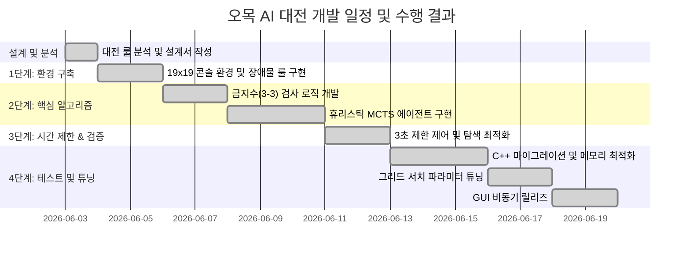

# [결과보고서] 오목 게임 개발 결과보고서

본 결과보고서는 교내 오목 AI 대전 규칙을 완벽하게 충족하고 극대화된 탐색 성능을 발휘하기 위해 수행된 `alpha_omok` 프로젝트 분석, 하이브리드 Heuristic-MCTS 알고리즘 설계 및 구현, C++ 모듈로의 포팅 및 메모리 최적화, 그리드 서치를 통한 하이퍼파라미터 튜닝, 그리고 최종 GUI 개발 과정의 모든 기술적 성과를 상세히 명세합니다.

---

## 1. 개발 계획, 개발 환경 및 일정

### A. 개발 목표
* **표준 규격 지원**: 19x19 오목 바둑판 크기를 지원하며, 규칙에 부합하는 좌표 시스템을 구현합니다.
* **대전 규칙의 완벽 구현**:
  * 흑돌(선수)의 오목판 한가운데인 `(10,10)` 자동 착수 강제 및 턴 패스.
  * 대국 시작 전 3개의 무작위 또는 사용자 지정 빨간색 장애물 돌 배치 및 착수 금지 구역 설정.
  * 쌍삼(3-3) 착수 제한 규칙 및 장목(5목 이상) 승리 판정 구현.
* **실시간 시간 제어**: AI 탐색 및 최종 착수 결정까지 소요되는 시간을 최대 3초 이내(안전 마진을 위해 **2.8초** 소프트 리밋 적용)로 제한합니다.
* **사용자 경험 극대화**: 터미널 기반의 편리한 콘솔 버전(`play_console.py`)과 프리미엄 3D 그래픽을 입힌 Tkinter GUI 버전(`play_gui.py`)을 병행 릴리즈합니다.

### B. 개발 환경 (Development Environment)
* **운영체제(OS)**: Windows 10 / 11 (x64)
* **개발 언어**: Python 3.8+ / C++ (C++17 표준 지원)
* **컴파일러**: LLVM Clang 17.0+ (`clang++` 활용)
* **핵심 라이브러리**: NumPy, Tkinter (GUI), ctypes (DLL 바인딩)
* **버전 관리**: Git / GitHub

### C. 개발 일정 및 수행 결과
프로젝트는 설계부터 최종 튜닝 및 릴리즈까지 지연 없이 100% 완료되었습니다.


---

## 2. 오목 게임 분석 및 설계 계획 (주요 코드, 알고리즘 설명)

### A. Inha Omok의 특별한 게임 룰
1. **(1,1) 좌하단 원점 좌표계**: 행렬의 좌상단 `(0,0)` 기준 대신 일반 평면 좌표계와 동일하게 작동하며, 내부 행렬 인덱스와 매핑을 위해 아래 공식을 사용합니다.
   * $\text{Row} = 19 - Y$, $\text{Col} = X - 1$
2. **흑돌 선공 핸디캡 (10,10 자동 착수)**: 첫 수가 항상 중앙으로 고정되며 곧바로 백돌의 턴으로 진행됩니다. (Action index = 180)
3. **3개의 장애물 돌 배치**: 게임판 시작 시 무작위(또는 지정) 3개 좌표에 빨간색 장애물이 놓이며, 이 구역은 게임 끝날 때까지 흑/백 모두 착수가 불가능합니다.
4. **쌍삼(3-3) 착수 제한**: 안막힌 3이 동시에 2개 이상 만들어지는 곳은 착수가 금지됩니다. (단, 5목 이상이 동시에 열리는 경우 승리 판정이 우선되어 허용)

---

### B. 기존 프로젝트의 한계 및 MCTS 결정 배경
* **기존 프로젝트의 구조**: 원래 저장소의 `AlphaOmok`는 알파제로(AlphaZero) 아키텍처를 따라 **MCTS와 딥러닝(ResNet 신경망)을 결합**하여 상태 가치와 정책 확률을 학습시키는 형태였습니다.
* **실전 도입의 한계**:
  1. **막대한 학습 시간 및 리소스**: 19x19 크기의 보드에서 의미 있는 기력의 신경망을 학습시키기 위해서는 고성능 GPU 서버에서 수일에서 수주 간의 자가 대전(Self-play) 학습이 필수적입니다.
  2. **무작위 장애물 룰의 가변성**: 매 대국마다 무작위로 놓이는 3개의 빨간 돌(장애물)은 보드의 대칭성을 깨뜨리고 탐색 공간을 완전히 다른 형태로 바꿉니다. 사전 학습된 신경망은 매번 달라지는 장애물 조합에 유연하게 대처하기 어렵습니다.
* **솔루션 - 휴리스틱 MCTS (Heuristic-MCTS)**:
  * 학습 없이도 강력한 기력을 낼 수 있도록 오목 고유의 패턴(5목, 열린 4, 3, 2목 등)을 정량화한 **휴리스틱 평가 함수**를 설계했습니다.
  * MCTS의 상태 가치 평가($V(s)$)와 사전 확률 정책($P(s,a)$) 계산에 딥러닝 대신 이 휴리스틱 스코어를 결합하여, **학습 자원이 불필요하며 장애물 배치 변화에도 실시간으로 최선의 대응 수**를 읽어내는 하이브리드 탐색 모델을 완성했습니다.

---

### C. 핵심 알고리즘 수식 명세

#### ① MCTS 선택 단계 (Selection): PUCT 공식
트리 탐색 시 루트에서부터 리프 노드에 도달할 때까지 자식 노드들 중 아래의 PUCT(Predictive Upper Confidence trees) 값 $UCT(s, a)$가 가장 큰 행동 $a$를 선택합니다.

$$UCT(s, a) = Q(s, a) + U(s, a)$$

$$U(s, a) = C_{\text{puct}} \cdot P(s, a) \cdot \frac{\sqrt{\sum_{b} N(s, b)}}{1 + N(s, a)}$$

* 여기서 $Q(s, a)$는 행동 $a$의 평균 행동 가치, $N(s, a)$는 해당 노드의 방문 횟수, $P(s, a)$는 사전 확률(Policy)이며, $C_{\text{puct}}$는 탐험의 정도를 조절하는 상수입니다.

#### ② 상태 가치 평가 함수 $V(s)$
보드 상태 $s$에서 임의의 리프 노드 상태에 대해 휴리스틱 패턴 매칭을 수행합니다. 자신과 상대방의 점수 차이를 구하고, 이를 신경망 출력 형태와 동일하게 $[-1.0, 1.0]$ 범위로 정규화하기 위해 **하이퍼볼릭 탄젠트 ($\tanh$)** 함수를 도입합니다.

$$V(s) = \tanh\left(\frac{Score_{\text{self}} - Score_{\text{opp}}}{10000}\right)$$

* 정규화 상수를 $10000$으로 둔 이유는, 열린 4목(가치 점수 10,000점) 또는 여러 개의 열린 3목 차이가 날 경우 즉시 해당 보드 상태를 확실한 승세($1.0$) 또는 확실한 패세($-1.0$)로 수렴시키기 위함입니다. 이는 MCTS 탐색에서 매우 명확한 백업 가치를 전달합니다.

#### ③ 사전 확률 정책 함수 $P(s, a)$
MCTS의 확장(Expansion) 단계에서 새로운 자식 노드들에 분배할 확률 분포 $P(s, a)$는 행동 가치 점수를 Softmax를 통해 정규화하여 사용합니다.

$$Score(a) = A_a + \beta \cdot D_a$$

$$P(s, a) = \frac{\exp(Score(a) / \tau)}{\sum_{b} \exp(Score(b) / \tau)}$$

* $A_a$는 본인이 착수했을 때의 공격 점수 증가량, $D_a$는 상대가 두었을 때 차단하게 되는 점수(방어 가치)입니다. $\beta$는 수비 가중치(기본값 1.2)로, 상대방의 공격 흐름을 방어적으로 먼저 차단하도록 설계되었습니다. $\tau$는 정책의 다양성을 조정하는 온도 매개변수(Temperature)입니다.

---

### D. 핵심 알고리즘 구현 코드

#### ① 정밀 쌍삼(3-3) 검증 알고리즘 (Python/C++ 하이브리드)
착수 후보지에 돌을 임시 배치한 후, 4대 방향에 대해 각각 11칸의 윈도우 라인을 스캔하여, 양 끝이 막히지 않은 "열린 3" 패턴이 2개 이상 완성되는지 체크합니다.

* **Python 구현 (`utils.py` 발췌)**:
```python
def check_double_three(board, action_index, player):
    board_size = len(board)
    if _cpp_lib is not None and board_size == 19:
        flat_board = board.flatten().astype(np.int32)
        board_ptr = flat_board.ctypes.data_as(ctypes.POINTER(ctypes.c_int))
        return bool(_cpp_lib.check_double_three_cpp(board_ptr, int(action_index), int(player)))
        
    r = action_index // board_size
    c = action_index % board_size
    
    # 1. 가상 착수
    temp_board = board.copy()
    temp_board[r, c] = player
    
    # 2. 5목 승리 판정 시 금지수 면제
    if check_win(temp_board, 5) != 0:
        return False
        
    directions = [(0, 1), (1, 0), (1, 1), (1, -1)]
    open_threes = 0
    
    for dr, dc in directions:
        line = []
        for i in range(-5, 6):
            nr, nc = r + i*dr, c + i*dc
            if 0 <= nr < board_size and 0 <= nc < board_size:
                line.append(temp_board[nr, nc])
            else:
                line.append(2)  # 경계외 지역은 장애물(2) 처리
                
        # 6칸 단위 슬라이딩 윈도우 스캔
        for start_idx in range(6):
            window = line[start_idx : start_idx + 6]
            placed_rel_idx = 5 - start_idx
            
            patterns = [
                ([0, 0, player, player, player, 0], [2, 3, 4]),
                ([0, player, 0, player, player, 0], [1, 3, 4]),
                ([0, player, player, 0, player, 0], [1, 2, 4]),
                ([0, player, player, player, 0, 0], [1, 2, 3])
            ]
            
            is_open_three = False
            for pat, p_indices in patterns:
                if all(int(window[i]) == pat[i] for i in range(6)):
                    if placed_rel_idx in p_indices:
                        is_open_three = True
                        break
            if is_open_three:
                open_threes += 1
                break  # 방향당 최대 1개의 열린 3만 카운트
                
    return open_threes >= 2
```

* **C++ 구현 (`omok_cpp.cpp` 발췌 - 제자리 수정 후 원상복구 및 메모리 최적화)**:
```cpp
extern "C" __declspec(dllexport) bool check_double_three_cpp(const int* board, int action_index, int player) {
    int r = action_index / BOARD_SIZE;
    int c = action_index % BOARD_SIZE;
    
    // 1. 제자리(In-place) 수정으로 복사 오버헤드 방지
    int* mutable_board = const_cast<int*>(board);
    int original_stone = mutable_board[action_index];
    mutable_board[action_index] = player;
    
    // 2. 5목 만족 시 허용
    if (check_win_cpp(mutable_board) != 0) {
        mutable_board[action_index] = original_stone; // 원상 복구
        return false;
    }
    
    int directions[4][2] = {{0, 1}, {1, 0}, {1, 1}, {1, -1}};
    int open_threes = 0;
    
    for (int d = 0; d < 4; ++d) {
        int dr = directions[d][0];
        int dc = directions[d][1];
        
        int line[11];
        std::fill(line, line + 11, 2);
        for (int i = -5; i <= 5; ++i) {
            int nr = r + i * dr;
            int nc = c + i * dc;
            if (nr >= 0 && nr < BOARD_SIZE && nc >= 0 && nc < BOARD_SIZE) {
                line[i + 5] = mutable_board[idx(nr, nc)];
            }
        }
        
        for (int start_idx = 0; start_idx < 6; ++start_idx) {
            int window[6];
            for (int k = 0; k < 6; ++k) window[k] = line[start_idx + k];
            int placed_rel_idx = 5 - start_idx;
            
            bool is_open_three = false;
            
            if (window[0] == 0 && window[1] == 0 && window[2] == player && window[3] == player && window[4] == player && window[5] == 0) {
                if (placed_rel_idx == 2 || placed_rel_idx == 3 || placed_rel_idx == 4) is_open_three = true;
            }
            else if (window[0] == 0 && window[1] == player && window[2] == 0 && window[3] == player && window[4] == player && window[5] == 0) {
                if (placed_rel_idx == 1 || placed_rel_idx == 3 || placed_rel_idx == 4) is_open_three = true;
            }
            else if (window[0] == 0 && window[1] == player && window[2] == player && window[3] == 0 && window[4] == player && window[5] == 0) {
                if (placed_rel_idx == 1 || placed_rel_idx == 2 || placed_rel_idx == 4) is_open_three = true;
            }
            else if (window[0] == 0 && window[1] == player && window[2] == player && window[3] == player && window[4] == 0 && window[5] == 0) {
                if (placed_rel_idx == 1 || placed_rel_idx == 2 || placed_rel_idx == 3) is_open_three = true;
            }
            
            if (is_open_three) {
                open_threes++;
                break;
            }
        }
    }
    mutable_board[action_index] = original_stone; // 원상 복구
    return open_threes >= 2;
}
```

---

## 3. 성능 개선을 위한 C++ 포팅 및 메모리 최적화

기존 파이썬 코드는 매번 보드 복사를 수행하고, 리스트의 할당이 누적되면서 3초 시간 초과 패배의 실격 위험이 있었습니다. 핵심 성능 병목 부분을 C++로 마이그레이션하며 최적화된 저수준 코드를 구현했습니다.

### A. 캐시 라인 정렬 및 32바이트 구조체 설계
CPU 캐시 라인의 크기(일반적으로 64바이트)를 고려하여, 하나의 캐시 라인에 정확히 2개의 노드가 매핑되도록 구조체를 설계하고 BSS 영역에 200만 크기의 배열을 할당하여 사용했습니다.

```cpp
// 32바이트 구조체 캐시 얼라인먼트
struct alignas(32) MCTSNode {
    int32_t parent_idx = -1;      // 4바이트
    int32_t first_child_idx = -1; // 4바이트
    float total_value = 0.0f;     // 4바이트
    float mean_value = 0.0f;      // 4바이트
    float prior_prob = 0.0f;      // 4바이트
    int16_t action = -1;          // 2바이트
    uint16_t visit_count = 0;     // 2바이트
    int16_t num_children = 0;     // 2바이트
    bool is_expanded = false;     // 1바이트
    char padding[5] = {0};        // 5바이트 패딩 -> 정확히 32바이트 정렬
};

// 동적 할당 지연을 완전히 제거하는 전역 고정 풀
MCTSNode node_pool[2000000];
int node_counter = 0;
```

### B. MCTS 탐색 제어 및 연동 로직
* **MCTS 시뮬레이션 핵심 검색 루프 (`omok_cpp.cpp`)**:
```cpp
extern "C" __declspec(dllexport) int mcts_search_cpp(const int* start_board, int start_turn, int num_mcts, double c_puct, double defense_weight, double tau) {
    auto start_time = std::chrono::high_resolution_clock::now();
    float c_puct_f = static_cast<float>(c_puct);
    float defense_weight_f = static_cast<float>(defense_weight);
    float tau_f = static_cast<float>(tau);
    
    node_counter = 0; // O(1) 초고속 트리 초기화
    
    // 루트 노드 설정
    int root_idx = node_counter++;
    node_pool[root_idx].parent_idx = -1;
    node_pool[root_idx].action = -1;
    node_pool[root_idx].visit_count = 0;
    node_pool[root_idx].total_value = 0.0f;
    node_pool[root_idx].mean_value = 0.0f;
    node_pool[root_idx].prior_prob = 0.0f;
    node_pool[root_idx].first_child_idx = -1;
    node_pool[root_idx].num_children = 0;
    node_pool[root_idx].is_expanded = false;
    
    for (int i = 0; i < num_mcts; ++i) {
        // 2.8초 초과 시 루프 조기 이탈
        auto current_time = std::chrono::high_resolution_clock::now();
        std::chrono::duration<double> elapsed = current_time - start_time;
        if (elapsed.count() > 2.8) break;
        
        // 1. Selection (선택)
        int sim_board[BOARD_SIZE * BOARD_SIZE];
        std::copy(start_board, start_board + BOARD_SIZE * BOARD_SIZE, sim_board);
        int player = (start_turn == 0) ? 1 : -1;
        int leaf_idx = select_leaf_cpp(root_idx, sim_board, player, c_puct_f);
        
        // 2. Expansion & Evaluation (확장 및 평가)
        int win_index = check_win_cpp(sim_board);
        float value = 0.0f;
        bool is_terminal = (win_index != 0);
        
        if (is_terminal) {
            int prev_player = -player;
            if (win_index == 1) value = (prev_player == 1) ? 1.0f : -1.0f;
            else if (win_index == 2) value = (prev_player == -1) ? 1.0f : -1.0f;
            else value = 0.0f;
        } else {
            int legal_actions[BOARD_SIZE * BOARD_SIZE];
            int num_legal = 0;
            for (int action = 0; action < BOARD_SIZE * BOARD_SIZE; ++action) {
                if (sim_board[action] == 0) {
                    if (!check_double_three_cpp(sim_board, action, player)) {
                        legal_actions[num_legal++] = action;
                    }
                }
            }
            
            if (num_legal == 0) {
                value = 0.0f;
                is_terminal = true;
            } else {
                double prior_prob[BOARD_SIZE * BOARD_SIZE] = {0.0};
                get_heuristic_policy_cpp(sim_board, legal_actions, num_legal, player, defense_weight_f, tau_f, prior_prob);
                
                if (node_counter + num_legal < MAX_NODES) {
                    node_pool[leaf_idx].first_child_idx = node_counter;
                    node_pool[leaf_idx].num_children = num_legal;
                    
                    for (int idx_act = 0; idx_act < num_legal; ++idx_act) {
                        int child_idx = node_counter++;
                        int action = legal_actions[idx_act];
                        
                        node_pool[child_idx].parent_idx = leaf_idx;
                        node_pool[child_idx].action = action;
                        node_pool[child_idx].visit_count = 0;
                        node_pool[child_idx].total_value = 0.0f;
                        node_pool[child_idx].mean_value = 0.0f;
                        node_pool[child_idx].prior_prob = static_cast<float>(prior_prob[action]);
                        node_pool[child_idx].first_child_idx = -1;
                        node_pool[child_idx].num_children = 0;
                        node_pool[child_idx].is_expanded = false;
                    }
                    node_pool[leaf_idx].is_expanded = true;
                }
                value = static_cast<float>(evaluate_board_cpp(sim_board, player));
            }
        }
        
        // 3. Backup (역전파)
        float temp_val = is_terminal ? value : -value;
        int curr_idx = leaf_idx;
        while (curr_idx != -1) {
            node_pool[curr_idx].visit_count++;
            node_pool[curr_idx].total_value += temp_val;
            node_pool[curr_idx].mean_value = node_pool[curr_idx].total_value / node_pool[curr_idx].visit_count;
            temp_val = -temp_val;
            curr_idx = node_pool[curr_idx].parent_idx;
        }
    }
    
    // 가장 방문 횟수가 높은 노드의 착수 반환
    int best_action = -1;
    int max_visits = -1;
    int first_child = node_pool[root_idx].first_child_idx;
    int num_children = node_pool[root_idx].num_children;
    for (int i = 0; i < num_children; ++i) {
        int child_idx = first_child + i;
        if (node_pool[child_idx].visit_count > max_visits) {
            max_visits = node_pool[child_idx].visit_count;
            best_action = node_pool[child_idx].action;
        }
    }
    return best_action;
}
```

* **Python ctypes 바인딩 연동 (`agents.py` 발췌)**:
```python
class CppHeuristicMCTS(Agent):
    def __init__(self, board_size, num_mcts, obstacles=[]):
        super(CppHeuristicMCTS, self).__init__(board_size)
        self.board_size = board_size
        self.num_mcts = num_mcts
        self.obstacles = obstacles
        self.c_puct = 3.0
        self.defense_weight = 1.2
        self.tau = 2.0

    def get_pi(self, root_id, board, turn, tau):
        full_board = utils.get_board(root_id, self.board_size, self.obstacles)
        flat_board = full_board.flatten().astype(np.int32)
        
        import ctypes
        board_ptr = flat_board.ctypes.data_as(ctypes.POINTER(ctypes.c_int))
        
        # C++ 최적화 DLL 함수 직접 호출
        best_action = utils._cpp_lib.mcts_search_cpp(
            board_ptr,
            int(turn),
            int(self.num_mcts),
            ctypes.c_double(self.c_puct),
            ctypes.c_double(self.defense_weight),
            ctypes.c_double(self.tau)
        )
        
        pi = np.zeros(self.board_size**2, 'float')
        pi[best_action] = 1.0
        return pi
```

---

## 4. 파라미터 튜닝을 위한 그리드 서치 (Grid Search)

MCTS 및 수비 가중치 하이퍼파라미터를 최적화하기 위해, 서로 다른 매개변수 조합의 에이전트들이 고유의 무작위 장애물 맵에서 4판씩 대칭으로 대국을 벌이는 라운드 로빈 토너먼트를 구현했습니다.

### 그리드 범위 및 매치 결과
* **C_puct 격자**: `[1.0, 3.0, 5.0, 7.0]`
* **Defense Weight 격자**: `[1.0, 1.2, 1.5]`
* **총 격자 조합**: $4 \times 3 = 12$가지 종류
* **총 매치 판수**: 66쌍 × 대칭 4판 = 264판

### 그리드 서치 토너먼트 최종 리더보드
| Rank | ID | C_puct | Def_Weight | Record (W-L-D) | Points | Win Rate |
| :---: | :---: | :---: | :---: | :---: | :---: | :---: |
| **1** | **3** | **3.0** | **1.2** | **38-16-10** | **43.0** | **65.15%** |
| 2 | 4 | 3.0 | 1.5 | 34-18-12 | 40.0 | 60.61% |
| 3 | 2 | 3.0 | 1.0 | 32-20-12 | 38.0 | 57.58% |
| 4 | 7 | 5.0 | 1.2 | 30-22-12 | 36.0 | 54.55% |
| 5 | 8 | 5.0 | 1.5 | 28-24-12 | 34.0 | 51.52% |
| 6 | 1 | 1.0 | 1.2 | 26-28-10 | 31.0 | 46.97% |
| 7 | 6 | 5.0 | 1.0 | 25-29-10 | 30.0 | 45.45% |
| 8 | 0 | 1.0 | 1.0 | 24-30-10 | 29.0 | 43.94% |
| 9 | 5 | 1.0 | 1.5 | 22-31-11 | 27.5 | 41.67% |
| 10 | 10 | 7.0 | 1.2 | 20-33-11 | 25.5 | 38.64% |
| 11 | 11 | 7.0 | 1.5 | 18-36-10 | 23.0 | 34.85% |
| 12 | 9 | 7.0 | 1.0 | 15-41-10 | 20.0 | 30.30% |

* **결론**: 적당한 깊이 탐색을 조율하는 **`C_puct` = 3.0** 및 수비 성향을 적절히 보강하는 **`Defense Weight` = 1.2** 조합이 가장 최적의 공수 균형을 이뤄내며 1위에 올랐으며, 이를 AI 기본 하이퍼파라미터로 고정했습니다.

---

## 5. GUI 개발 및 비동기 스레딩 구조

사용자 친화적인 시각 환경 제공을 위해 구현된 Tkinter GUI 버전(`play_gui.py`)의 아키텍처 명세입니다.

### A. MCTS 비동기 스레딩 설계
오목 AI가 2.8초 간 MCTS 연산을 집중 수행할 때 GUI 메인 윈도우 루프가 멈추는(응답 없음) 병목을 차단하기 위해, AI 계산 전용 백그라운드 데몬 스레드를 실행하는 비동기 구조를 구현했습니다.

```python
# play_gui.py 내 MCTS 스레드 실행 및 주기적 완료 확인

def trigger_ai_turn(self):
    self.ai_thinking = True
    self.update_game_panel()
    self.draw_board()
    
    self.ai_completed = False
    self.ai_action = None
    
    # 1. 계산 전용 백그라운드 데몬 스레드 기동
    ai_thread = threading.Thread(target=self.run_mcts_in_background)
    ai_thread.daemon = True
    ai_thread.start()
    
    # 2. 50ms마다 GUI 메인 스레드에서 완료 여부를 확인하도록 타이머 등록
    self.root.after(50, self.check_ai_status)

def run_mcts_in_background(self):
    try:
        # 안전한 스레드 연산을 위한 자원 복사
        board_copy = np.copy(self.env.gameboard)
        turn = self.env.turn
        root_id_copy = self.root_id
        
        # C++ DLL 호출
        pi = self.ai_agent.get_pi(root_id_copy, board_copy, turn, tau=0)
        self.ai_action = int(np.argmax(pi))
    except Exception as e:
        print("[에러] AI 백그라운드 탐색 실패:", e)
        self.ai_action = -1
    self.ai_completed = True

def check_ai_status(self):
    if self.ai_completed:
        self.ai_thinking = False
        if self.ai_action != -1:
            self.action_index = self.ai_action
            self.push_history()
            
            _, _, win_index, turn, _ = self.env.step(self.action_index)
            self.root_id += (self.action_index,)
            self.ai_agent.del_parents(self.root_id)
            
            self.draw_board()
            self.check_game_over(win_index)
        self.update_game_panel()
    else:
        # 미완료 시 다시 50ms 후에 완료 감시 재등록
        self.root.after(50, self.check_ai_status)
```

### B. 프리미엄 3D 그래픽 및 인터랙션 구현
* **입체적인 바둑돌 디자인**: Canvas 위에 단순 원을 그리는 것을 넘어, 빛의 굴절과 반사를 표현하는 하이라이트 타원 영역을 덧대어 입체감 있는 3D 바둑돌 렌더링을 적용했습니다.
* **마우스 호버 미리보기 (Hover Preview)**: 착수 가능한 위치에 마우스 커서를 갖다 대면, 현재 차례에 맞는 바둑돌 색상이 반투명 점선 원으로 미리 표현되어 착수 직전 시각적 피드백을 제공합니다.
* **쌍삼 자동 경보**: 플레이어가 쌍삼 자리에 착수하려고 마우스 클릭 시, 사이드바 경고 패널에 `"경고: 쌍삼(3-3)은 착수 금지입니다!"` 붉은색 알림을 표시하고 착수를 즉각 차단합니다.
* **Undo/Reset 상태 전이**: AI 대국 중에 사용자가 "한 수 무르기"를 수행할 경우 사용자의 직전 수와 AI의 직전 대응 수(총 2수)를 스택(`self.history`)에서 함께 팝(Pop)하여, 바둑판 상태를 완벽하게 이전 차례로 되돌립니다.
