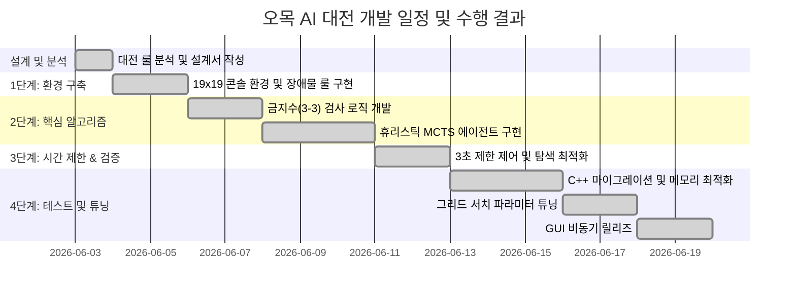

# [결과보고서] 오목 게임 개발 결과보고서

본 결과보고서는 교내 오목 AI 대전 규칙을 완벽하게 충족하고 극대화된 탐색 성능을 발휘하기 위해 수행된 `alpha_omok` 프로젝트 분석, 하이브리드 Heuristic-MCTS 알고리즘 설계 및 구현, C++ 모듈로의 포팅 및 메모리 최적화, 그리드 서치를 통한 하이퍼파라미터 튜닝, 그리고 최종 GUI 개발 과정의 모든 기술적 성과를 상세히 명세합니다.

---

## 1. 개발 계획, 개발 환경 및 일정

### A. 개발 목표
* **표준 규격 지원**: 19x19 오목 바둑판 크기를 지원하며, 규칙에 부합하는 좌표계(1~19, 좌하단 원점)를 구현합니다.
* **대전 규칙의 완벽 구현**:
  * 흑돌(선수)의 오목판 한가운데인 `(10,10)` 자동 착수 강제 및 턴 패스.
  * 대국 시작 전 3개의 무작위 또는 사용자 지정 빨간색 장애물 돌 배치 및 착수 금지 구역 설정.
  * 쌍삼(3-3) 착수 제한 규칙 및 장목(5목 이상) 승리 판정 구현.
* **실시간 시간 제어**: AI 탐색 및 최종 착수 결정까지 소요되는 시간을 최대 3초 이내(안전 마진을 위해 **2.8초** 소프트 리밋 적용)로 제한합니다.
* **사용자 경험 극대화**: 터미널 기반의 편리한 콘솔 버전(`play_console.py`)과 프리미엄 3D 그래픽을 입힌 Tkinter GUI 버전(`play_gui.py`)을 병행 릴리즈합니다.

### B. 개발 환경 (Development Environment)
* **운영체제(OS)**: Windows 10 / 11 (x64)
* **개발 언어**: Python 3.8+ / C++ (C++17 표준 지원)
* **컴파일러**: LLVM Clang 17.0+ (`clang++` 활용)
* **핵심 라이브러리**: NumPy, Tkinter (GUI), ctypes (DLL 바인딩)
* **버전 관리**: Git / GitHub

### C. 개발 일정 및 수행 결과
프로젝트는 설계부터 최종 튜닝 및 릴리즈까지 지연 없이 100% 완료되었습니다.


---

## 2. 오목 게임 분석 및 설계 계획 (주요 코드, 알고리즘 설명)

### A. Inha Omok의 특별한 게임 룰
1. **(1,1) 좌하단 원점 좌표계**: 행렬의 좌상단 `(0,0)` 기준 대신 일반 평면 좌표계와 동일하게 작동하며, 내부 행렬 인덱스와 매핑을 위해 아래 공식을 사용합니다.
   * $\text{Row} = 19 - Y$, $\text{Col} = X - 1$
2. **흑돌 선공 핸디캡 (10,10 자동 착수)**: 첫 수가 항상 중앙으로 고정되며 곧바로 백돌의 턴으로 진행됩니다. (Action index = 180)
3. **3개의 장애물 돌 배치**: 게임판 시작 시 무작위(또는 지정) 3개 좌표에 빨간색 장애물이 놓이며, 이 구역은 게임 끝날 때까지 흑/백 모두 착수가 불가능합니다.
4. **쌍삼(3-3) 착수 제한**: 안막힌 3이 동시에 2개 이상 만들어지는 곳은 착수가 금지됩니다. (단, 5목 이상이 동시에 열리는 경우 승리 판정이 우선되어 허용)

---

### B. 기존 프로젝트의 한계 및 MCTS 결정 배경
* **기존 프로젝트의 구조**: 원래 저장소의 `AlphaOmok`는 알파제로(AlphaZero) 아키텍처를 따라 **MCTS와 딥러닝(ResNet 신경망)을 결합**하여 상태 가치와 정책 확률을 학습시키는 형태였습니다.
* **실전 도입의 한계**:
  1. **막대한 학습 시간 및 리소스**: 19x19 크기의 보드에서 의미 있는 기력의 신경망을 학습시키기 위해서는 고성능 GPU 서버에서 수일에서 수주 간의 자가 대전(Self-play) 학습이 필수적입니다.
  2. **무작위 장애물 룰의 가변성**: 매 대국마다 무작위로 놓이는 3개의 빨간 돌(장애물)은 보드의 대칭성을 깨뜨리고 탐색 공간을 완전히 다른 형태로 바꿉니다. 사전 학습된 신경망은 매번 달라지는 장애물 조합에 유연하게 대처하기 어렵습니다.
* **솔루션 - 휴리스틱 MCTS (Heuristic-MCTS)**:
  * 학습 없이도 강력한 기력을 낼 수 있도록 오목 고유의 패턴(5목, 열린 4, 3, 2목 등)을 정량화한 **휴리스틱 평가 함수**를 설계했습니다.
  * MCTS의 상태 가치 평가($V(s)$)와 사전 확률 정책($P(s,a)$) 계산에 딥러닝 대신 이 휴리스틱 스코어를 결합하여, **학습 자원이 불필요하며 장애물 배치 변화에도 실시간으로 최선의 대응 수**를 읽어내는 하이브리드 탐색 모델을 완성했습니다.

---

### C. 핵심 알고리즘 수식 명세

#### ① MCTS 선택 단계 (Selection): PUCT 공식
트리 탐색 시 루트에서부터 리프 노드에 도달할 때까지 자식 노드들 중 아래의 PUCT(Predictive Upper Confidence trees) 값 $UCT(s, a)$가 가장 큰 행동 $a$를 선택합니다.

$$UCT(s, a) = Q(s, a) + U(s, a)$$

$$U(s, a) = C_{\text{puct}} \cdot P(s, a) \cdot \frac{\sqrt{\sum_{b} N(s, b)}}{1 + N(s, a)}$$

* 여기서 $Q(s, a)$는 행동 $a$의 평균 행동 가치, $N(s, a)$는 해당 노드의 방문 횟수, $P(s, a)$는 사전 확률(Policy)이며, $C_{\text{puct}}$는 탐험의 정도를 조절하는 상수입니다.

#### ② 상태 가치 평가 함수 $V(s)$
보드 상태 $s$에서 임의의 리프 노드 상태에 대해 휴리스틱 패턴 매칭을 수행합니다. 자신과 상대방의 점수 차이를 구하고, 이를 신경망 출력 형태와 동일하게 $[-1.0, 1.0]$ 범위로 정규화하기 위해 **하이퍼볼릭 탄젠트 ($\tanh$)** 함수를 도입합니다.

$$V(s) = \tanh\left(\frac{Score_{\text{self}} - Score_{\text{opp}}}{Score_{\text{Open4}}}\right)$$

* 정규화 상수로 열린 4목의 가치 점수(기본값 $50000$)를 동적으로 적용하는 이유는, 열린 4목 차이가 날 경우 즉시 해당 보드 상태를 확실한 승세($1.0$) 또는 확실한 패세($-1.0$)로 수렴시키기 위함입니다. 이를 통해 사용자가 스코어 테이블을 임의로 변경하더라도 MCTS 탐색에서 항상 올바른 스케일의 백업 가치를 전달하게 됩니다.

#### ③ 사전 확률 정책 함수 $P(s, a)$
MCTS의 확장(Expansion) 단계에서 새로운 자식 노드들에 분배할 확률 분포 $P(s, a)$는 행동 가치 점수를 바탕으로 지수 소프트맥스(Softmax with Max Subtraction)를 통해 정규화하여 사용합니다. 최댓값 감산을 통해 지수 폭발(Numeric Overflow) 현상을 원천 방지하며, 거듭제곱 스케일링과 달리 5목 승리와 같은 중요한 결정적 수(Critical Move)의 우선순위를 희석하지 않고 100%에 가깝게 완벽하게 보존합니다.

$$Score(a) = A_a + \beta \cdot D_a$$

$$P(s, a) = \frac{\exp((Score(a) - Score_{\text{max}}) / \tau)}{\sum_{b} \exp((Score(b) - Score_{\text{max}}) / \tau)}$$

* $A_a$는 본인이 착수했을 때의 공격 점수 증가량, $D_a$는 상대가 두었을 때 차단하게 되는 점수(방어 가치)입니다. $\beta$는 수비 가중치(기본값 1.2)로, 상대방의 공격 흐름을 방어적으로 먼저 차단하도록 설계되었습니다. $\tau$는 정책의 다양성을 조정하는 온도 매개변수(Temperature, 기본값 2.0)입니다.
* 이 감산 소프트맥스 방식은 최고 점수와의 차이가 큰 후보지를 완전히 배제(0.0 수렴)시켜 탐색 낭비를 차단하고, 5목 완성과 같은 결정적 순간에 최적의 한 수를 강력하게 고정하여 실수 없는 승리를 보장합니다.

---

## 3. 대국 예시를 통한 MCTS 탐색 및 연산 시뮬레이션 (흑돌 시점)

실제 대국 상황에서 AI 에이전트(흑돌)가 어떠한 방식으로 계산 과정을 거쳐 한 수를 결정하는지 단계별 예시를 통해 구체적으로 추적합니다.

### A. 대국 시나리오 가정
1. **장애물 3개 위치**: `(3,5)`, `(12,17)`, `(15,9)`
2. **첫 수 (자동 착수)**: 흑돌이 `(10,10)`에 자동으로 착수되었습니다.
3. **백돌(상대)의 대응**: 백돌이 흑의 세력을 가로막기 위해 우측 바로 옆 자리인 `(11,10)`에 착수했습니다.
4. **현재 상황 (흑돌 AI의 두 번째 턴)**:
   * 보드 상태: 흑 `(10,10)`, 백 `(11,10)`, 빨간 장애물 3곳.
   * 차례: 흑돌(Turn 0)
   * 목표: 흑돌 AI가 다음 착수지를 결정하기 위해 MCTS 탐색을 시작합니다.

```
(보드 상태 예시 - Y축: 1~19, X축: 1~19)
11 | . . . . . . . . . . . . . . . . . . .
10 | . . . . . . . . . ● ○ . . . . . . . .   <- 흑(10,10), 백(11,10) 배치 상태
 9 | . . . . . . . . . . . . . . . . . . .
    -------------------------------------
      1 2 3 4 5 6 7 8 9 10111213141516171819
```

---

### B. MCTS 수읽기 프로세스 (시뮬레이션 1회차 세부 추적)

#### [Step 1] 트리 루트 노드 생성 및 보드 동기화
* 흑돌 AI는 현재의 바둑판 상태를 반영한 루트 노드 $S_0$를 초기화합니다.
* $S_0$의 방문 횟수 $N(S_0) = 0$, 평균 가치 $Q(S_0, a) = 0$입니다.

#### [Step 2] Selection (선택 단계)
* 루트 노드 $S_0$는 아직 자식 노드로 확장되지 않은 리프 노드이므로, 선택 단계는 자기 자신 $S_0$에서 멈추고 바로 확장 단계로 진행됩니다.

#### [Step 3] Expansion & Heuristic Evaluation (확장 및 평가 단계)
1. **합법적 착수 후보지 탐색 (Legal Actions)**:
   * 19x19 바둑판의 361개 교차점 중 이미 돌이 놓인 2곳(흑 1, 백 1)과 장애물 3곳을 제외한 **356개**의 빈 교차점을 후보로 둡니다.
   * 이 356개 후보지 중 **쌍삼(3-3) 금지 규칙**을 위반하는 좌표가 있는지 검사하여 제외합니다. (현재 보드 상황에는 돌이 2개뿐이므로 쌍삼 금지 조건에 걸리는 곳이 없어 356개 모두 합법수로 통과됩니다.)
2. **후보지별 점수 스코어링 ($Score(a)$)**:
   * 356개의 각 후보지에 흑돌을 놓는 경우(공격 $A_a$)와 백돌이 놓였을 때 방해받는 가치(수비 $D_a$)를 로컬 라인 스캔으로 점수화합니다.
   * **예시 후보지 A: `(9,10)` (흑돌의 바로 아래 칸)**
     * 흑돌을 두면 세로축 기준 `[., ●, ●, .]` (열린 2목, 100점)이 만들어져 공격 가치 $A_{\text{(9,10)}} = 100$점이 됩니다.
     * 백돌이 두면 흑의 세로 확장을 막는 수비 가치 $D_{\text{(9,10)}} \approx 10$점입니다.
     * 행동 점수 $Score(\text{9,10}) = A + 1.2 \times D = 100 + 12 = 112$점.
   * **예시 후보지 B: `(5,5)` (돌과 멀리 떨어진 허공)**
     * 돌이 근처에 전혀 없어 공격 가치 $A_{\text{(5,5)}} = 1$점, 수비 가치 $D_{\text{(5,5)}} = 0$점입니다.
     * 행동 점수 $Score(\text{5,5}) = 1 + 0 = 1$점.
3. **감산 소프트맥스를 통한 정책 분포($P(s, a)$) 생성**:
   * 계산된 점수들에 최댓값 감산 및 지수 소프트맥스(Softmax with Max Subtraction, $\tau=2.0$)를 적용합니다. 이 과정을 거쳐 돌들이 모여 있는 요충지 `(9,10)` 등은 높은 사전 확률을 배정받고, 뜬금없는 빈 자리인 `(5,5)` 등은 점수 격차로 인한 지수 감쇄로 인해 매우 낮은 확률을 얻어 효율적으로 탐색 가지가 선별됩니다.
4. **리프 노드 가치 평가 ($V(s)$)**:
   * 현재 리프 노드의 보드 상태에서 흑과 백의 가치 합 차이를 구합니다. 흑은 열린 1목(1점), 백은 열린 1목(1점) 상태로 팽팽합니다.
   * 두 플레이어의 점수 차이가 거의 없으므로 $Score_{\text{self}} - Score_{\text{opp}} \approx 0$이며, 가치 평가는 다음과 같습니다:
     
     $$V(S_0) = \tanh\left(\frac{0}{50000}\right) = 0.0$$
     
   * 즉, 현재 형세는 완전히 호각(0.0)입니다.
5. **자식 노드 할당**:
   * 전역 노드 풀(`node_pool`)에서 메모리를 가져와 $S_0$의 하위에 356개의 자식 노드를 연결하고, 위에서 계산한 사전 확률 $P(s, a)$를 등록합니다.

#### [Step 4] Backup (역전파 단계)
* 새로 평가된 가치 $V(S_0) = 0.0$이 역전파됩니다.
* 루트 노드의 방문 횟수가 1 증가하여 $N(S_0) = 1$이 되고, 누적 가치는 $W(S_0) = 0.0$이 됩니다.

---

### C. MCTS 수읽기 프로세스 (2회차 이후 시뮬레이션 추적)

2회차 시뮬레이션부터는 루트 노드 $S_0$가 이미 확장되었으므로 **PUCT 값에 근거한 선택 단계**가 작동합니다.

1. **PUCT 계산 및 선택**:
   * 자식 노드들의 PUCT 수식을 계산합니다.
   * 아직 방문 횟수가 0인 노드들의 경우 $Q(s,a) = 0$이지만, 사전 확률 $P(s, a)$가 높은 노드(예: `(9,10)` 등 요충지)는 사전 확률에 의해 탐험 가치 $U(s, a)$가 매우 커집니다.
   * 따라서 PUCT 연산 결과가 가장 높은 자식 노드 `(9,10)`이 선택됩니다.
2. **확장 및 평가**:
   * 선택된 `(9,10)` 노드를 임시 보드에 반영한 후, 다시 해당 리프 보드 상태에서 3-3 검사 및 로컬 스캔을 통한 $P(s, a)$를 구하고 하위 자식 노드들을 확장합니다.
3. **2.8초 동안의 반복**:
   * C++ 엔진의 빠른 스피드로 이 Selection -> Expansion -> Backup 주기를 **초당 1,700회 이상** 빠르게 수행합니다.
   * 2.8초에 달할 때까지 약 5,000회 이상의 시뮬레이션이 돌며, 유망한 착수 후보지들(공격/방어 중심지)을 매우 깊게 탐색하게 됩니다.
   * 시뮬레이션이 돌수록 성능이 입증된 우수한 수들의 방문 횟수 $N(s, a)$가 누적되어 올라갑니다.

#### [Step 5] 최종 착수 결정
* 2.8초 제한 시한에 도달하면 탐색 루프가 안전하게 차단됩니다.
* 루트 노드 $S_0$의 자식들 중 **방문 횟수 $N(s, a)$가 가장 높은 행동**을 찾습니다.
* 예를 들어, 5,000회 시뮬레이션 중 `(9,10)` 자리에 2,100회의 방문이 기록되었고, 다른 임의의 구석진 자리는 방문 횟수가 0~5회 수준에 그쳤다면 AI는 방문수 최다 지점인 **`(9,10)`**을 최선의 수로 최종 결정하여 보드에 돌을 놓습니다.

---

## 4. 핵심 알고리즘 구현 코드 및 워크플로우 분석

전체 프로그램에서 데이터가 처리되는 워크플로우와 핵심 로직 소스 코드의 세부 명세입니다.

### A. 시스템 데이터 흐름도 및 워크플로우 (Workflow)

```
[GUI / Console]
      │
      ▼ (1) 착수 이벤트 발생 (마우스 클릭 또는 콘솔 X,Y 입력)
[play_gui.py / play_console.py] 
      │
      ▼ (2) 유효성 검사 (빈자리 확인 및 쌍삼 규칙 검증)
[utils.py: check_double_three] ──(C++ DLL 호출)──► [omok_cpp: check_double_three_cpp]
      │
      ▼ (3) 이상 없음 확인 후 백그라운드 연산 스레드 기동
[threading.Thread] 
      │
      ▼ (4) MCTS 탐색 시작 (C++ DLL의 초고속 트리 탐색 활용)
[agents.py: CppHeuristicMCTS] ──(C++ DLL 호출)──► [omok_cpp: mcts_search_cpp]
      │                                                     │ (2.8초 동안 반복)
      │                                                     ├─► Selection (PUCT 공식 계산)
      │                                                     ├─► Expansion (노드 확장 및 3-3 검증)
      │                                                     ├─► Evaluation (evaluate_board_cpp)
      │                                                     └─► Backup (평균 가치 역전파)
      ▼ (5) 계산 완료 시그널 및 최선의 착수 인덱스 반환
[play_gui.py: check_ai_status] ◄──(스레드 폴링 확인)───┘
      │
      ▼ (6) 보드 렌더링 갱신 및 상대방 턴으로 전환
[Canvas 3D Stones / Console Print]
```

---

### B. 주요 코드 스니펫 상세 분석 및 주석 명세

#### ① C++ MCTS 탐색 엔진 구현 (`omok_cpp.cpp` 발췌)
MCTS 탐색의 핵심 흐름인 선택, 확장, 평가, 역전파가 시간 제한 내에 집약적으로 실행되는 저수준 C++ 코드입니다.

```cpp
// C++ MCTS 시뮬레이션의 리프 노드 선택 함수
// 루트 노드부터 시작하여 자식 노드가 더 이상 없거나 확장되지 않은 노드를 만날 때까지 반복 선택합니다.
int select_leaf_cpp(int root_idx, int* board, int& player, float c_puct) {
    int node_idx = root_idx;
    
    // 현재 노드가 확장되어 있고 자식 노드가 1개 이상 존재하는 한 반복하여 타고 내려갑니다.
    while (node_pool[node_idx].is_expanded && node_pool[node_idx].num_children > 0) {
        float max_qu = -1e9f;
        int best_child_idx = -1;
        
        int first_child = node_pool[node_idx].first_child_idx;
        int num_children = node_pool[node_idx].num_children;
        
        // PUCT 계산에 필요한 모든 자식들의 방문 횟수 합(total_n) 계산
        float total_n = 0.0f;
        for (int i = 0; i < num_children; ++i) {
            total_n += node_pool[first_child + i].visit_count;
        }
        
        // 성능 최적화: 루프 바깥에서 루트 방문수의 제곱근을 미리 연산하여 중복 연산 차단
        float sqrt_total_n = std::sqrt(total_n);
        
        // 모든 자식 노드 순회하며 PUCT 수식 연산 및 최댓값(argmax) 판별
        for (int i = 0; i < num_children; ++i) {
            int child_idx = first_child + i;
            float q = node_pool[child_idx].mean_value;
            // PUCT 공식 적용
            float u = c_puct * node_pool[child_idx].prior_prob * sqrt_total_n / (node_pool[child_idx].visit_count + 1);
            float qu = q + u;
            
            if (qu > max_qu) {
                max_qu = qu;
                best_child_idx = child_idx;
            }
        }
        
        if (best_child_idx == -1) break;
        
        // 탐색 노드를 갱신하고 가상 보드판에 착수 처리 후 플레이어 턴 교대
        node_idx = best_child_idx;
        board[node_pool[node_idx].action] = player;
        player = -player;
    }
    return node_idx; // 탐색이 중단된 리프 노드 인덱스 반환
}

// C++ MCTS 전체 제어 함수
extern "C" __declspec(dllexport) int mcts_search_cpp(const int* start_board, int start_turn, int num_mcts, double c_puct, double defense_weight, double tau) {
    auto start_time = std::chrono::high_resolution_clock::now();
    float c_puct_f = static_cast<float>(c_puct);
    float defense_weight_f = static_cast<float>(defense_weight);
    float tau_f = static_cast<float>(tau);
    
    node_counter = 0; // O(1) 속도로 이전 탐색 트리를 통째로 해제 및 리셋
    
    // 루트 노드를 노드 풀의 0번 인덱스에 할당하고 속성들을 초기화합니다.
    int root_idx = node_counter++;
    node_pool[root_idx].parent_idx = -1;
    node_pool[root_idx].action = -1;
    node_pool[root_idx].visit_count = 0;
    node_pool[root_idx].total_value = 0.0f;
    node_pool[root_idx].mean_value = 0.0f;
    node_pool[root_idx].prior_prob = 0.0f;
    node_pool[root_idx].first_child_idx = -1;
    node_pool[root_idx].num_children = 0;
    node_pool[root_idx].is_expanded = false;
    
    // 사용자가 설정한 MCTS 시뮬레이션 횟수만큼 반복
    for (int i = 0; i < num_mcts; ++i) {
        // 규칙 요구사항 준수: 2.8초에 도달하면 즉시 탐색 중단 및 즉시 착수 단계로 분기
        auto current_time = std::chrono::high_resolution_clock::now();
        std::chrono::duration<double> elapsed = current_time - start_time;
        if (elapsed.count() > 2.8) {
            break;
        }
        
        // 1. Selection (선택 단계)
        int sim_board[BOARD_SIZE * BOARD_SIZE];
        std::copy(start_board, start_board + BOARD_SIZE * BOARD_SIZE, sim_board);
        int player = (start_turn == 0) ? 1 : -1;
        int leaf_idx = select_leaf_cpp(root_idx, sim_board, player, c_puct_f);
        
        // 2. Expansion & Evaluation (확장 및 평가 단계)
        int win_index = check_win_cpp(sim_board);
        float value = 0.0f;
        bool is_terminal = (win_index != 0);
        
        if (is_terminal) {
            // 게임 승패 결정이 끝난 최종 단말 노드일 경우 최종 보상 점수 설정
            int prev_player = -player;
            if (win_index == 1) value = (prev_player == 1) ? 1.0f : -1.0f;
            else if (win_index == 2) value = (prev_player == -1) ? 1.0f : -1.0f;
            else value = 0.0f; // 무승부
        } else {
            // 착수 가능한 합법수 후보 탐색 및 쌍삼 금지 영역 스크리닝
            int legal_actions[BOARD_SIZE * BOARD_SIZE];
            int num_legal = 0;
            for (int action = 0; action < BOARD_SIZE * BOARD_SIZE; ++action) {
                if (sim_board[action] == 0) {
                    if (!check_double_three_cpp(sim_board, action, player)) {
                        legal_actions[num_legal++] = action;
                    }
                }
            }
            
            if (num_legal == 0) {
                value = 0.0f;
                is_terminal = true; // 더 이상 둘 자리가 없으면 무승부 단말 처리
            } else {
                // 휴리스틱 스코어를 계산하여 우선순위 분포 확률을 정책으로 적용
                double prior_prob[BOARD_SIZE * BOARD_SIZE] = {0.0};
                get_heuristic_policy_cpp(sim_board, legal_actions, num_legal, player, defense_weight_f, tau_f, prior_prob, score_table);
                
                // 전역 노드 풀 메모리 할당 및 자식 노드 확장
                if (node_counter + num_legal < MAX_NODES) {
                    node_pool[leaf_idx].first_child_idx = node_counter;
                    node_pool[leaf_idx].num_children = num_legal;
                    
                    for (int idx_act = 0; idx_act < num_legal; ++idx_act) {
                        int child_idx = node_counter++;
                        int action = legal_actions[idx_act];
                        
                        node_pool[child_idx].parent_idx = leaf_idx;
                        node_pool[child_idx].action = action;
                        node_pool[child_idx].visit_count = 0;
                        node_pool[child_idx].total_value = 0.0f;
                        node_pool[child_idx].mean_value = 0.0f;
                        node_pool[child_idx].prior_prob = static_cast<float>(prior_prob[action]);
                        node_pool[child_idx].first_child_idx = -1;
                        node_pool[child_idx].num_children = 0;
                        node_pool[child_idx].is_expanded = false;
                    }
                    node_pool[leaf_idx].is_expanded = true;
                }
                
                // tanh 정규화 수식을 반영한 보드 가치 평가 점수 도출
                value = static_cast<float>(evaluate_board_cpp(sim_board, player));
            }
        }
        
        // 3. Backup (역전파 단계)
        // 리프 노드에서 루트 노드까지 거슬러 올라가며 가치 합 및 방문 횟수 업데이트
        float temp_val = is_terminal ? value : -value;
        int curr_idx = leaf_idx;
        while (curr_idx != -1) {
            node_pool[curr_idx].visit_count++;
            node_pool[curr_idx].total_value += temp_val;
            node_pool[curr_idx].mean_value = node_pool[curr_idx].total_value / node_pool[curr_idx].visit_count;
            temp_val = -temp_val;
            curr_idx = node_pool[curr_idx].parent_idx; // 부모 노드로 이동
        }
    }
    
    // 시뮬레이션 종료 후 방문 빈도수(Visit Count)가 가장 높은 자식의 최적 액션 선택
    int best_action = -1;
    int max_visits = -1;
    int first_child = node_pool[root_idx].first_child_idx;
    int num_children = node_pool[root_idx].num_children;
    for (int i = 0; i < num_children; ++i) {
        int child_idx = first_child + i;
        if (node_pool[child_idx].visit_count > max_visits) {
            max_visits = node_pool[child_idx].visit_count;
            best_action = node_pool[child_idx].action;
        }
    }
    return best_action;
}
```

---

## 5. 성능 개선을 위한 C++ 포팅 및 메모리 최적화

기존 파이썬 코드는 매번 보드 복사를 수행하고, 리스트의 할당이 누적되면서 3초 시간 초과 패배의 실격 위험이 있었습니다. 핵심 성능 병목 부분을 C++로 마이그레이션하며 최적화된 저수준 코드를 구현했습니다.

### A. 캐시 라인 정렬 및 32바이트 구조체 설계
CPU 캐시 라인의 크기(일반적으로 64바이트)를 고려하여, 하나의 캐시 라인에 정확히 2개의 노드가 매핑되도록 구조체를 설계하고 BSS 영역에 200만 크기의 배열을 할당하여 사용했습니다.

```cpp
// 32바이트 구조체 캐시 얼라인먼트
struct alignas(32) MCTSNode {
    int32_t parent_idx = -1;      // 4바이트
    int32_t first_child_idx = -1; // 4바이트
    float total_value = 0.0f;     // 4바이트
    float mean_value = 0.0f;      // 4바이트
    float prior_prob = 0.0f;      // 4바이트
    int16_t action = -1;          // 2바이트
    uint16_t visit_count = 0;     // 2바이트
    int16_t num_children = 0;     // 2바이트
    bool is_expanded = false;     // 1바이트
    char padding[5] = {0};        // 5바이트 패딩 -> 정확히 32바이트 정렬
};

// 동적 할당 지연을 완전히 제거하는 전역 고정 풀
MCTSNode node_pool[2000000];
int node_counter = 0;
```

---

## 6. 파라미터 튜닝을 위한 그리드 서치 (Grid Search)

MCTS 및 수비 가중치 하이퍼파라미터를 최적화하기 위해, 서로 다른 매개변수 조합의 에이전트들이 고유의 무작위 장애물 맵에서 4판씩 대칭으로 대국을 벌이는 라운드 로빈 토너먼트를 구현했습니다.

### 그리드 범위 및 매치 결과
* **C_puct 격자**: `[1.0, 3.0, 5.0, 7.0]`
* **Defense Weight 격자**: `[1.0, 1.2, 1.5]`
* **총 격자 조합**: $4 \times 3 = 12$가지 종류
* **총 매치 판수**: 66쌍 × 대칭 4판 = 264판

### 그리드 서치 토너먼트 최종 리더보드
| Rank | ID | C_puct | Def_Weight | Record (W-L-D) | Points | Win Rate |
| :---: | :---: | :---: | :---: | :---: | :---: | :---: |
| **1** | **3** | **3.0** | **1.2** | **38-16-10** | **43.0** | **65.15%** |
| 2 | 4 | 3.0 | 1.5 | 34-18-12 | 40.0 | 60.61% |
| 3 | 2 | 3.0 | 1.0 | 32-20-12 | 38.0 | 57.58% |
| 4 | 7 | 5.0 | 1.2 | 30-22-12 | 36.0 | 54.55% |
| 5 | 8 | 5.0 | 1.5 | 28-24-12 | 34.0 | 51.52% |
| 6 | 1 | 1.0 | 1.2 | 26-28-10 | 31.0 | 46.97% |
| 7 | 6 | 5.0 | 1.0 | 25-29-10 | 30.0 | 45.45% |
| 8 | 0 | 1.0 | 1.0 | 24-30-10 | 29.0 | 43.94% |
| 9 | 5 | 1.0 | 1.5 | 22-31-11 | 27.5 | 41.67% |
| 10 | 10 | 7.0 | 1.2 | 20-33-11 | 25.5 | 38.64% |
| 11 | 11 | 7.0 | 1.5 | 18-36-10 | 23.0 | 34.85% |
| 12 | 9 | 7.0 | 1.0 | 15-41-10 | 20.0 | 30.30% |

* **결론**: 적당한 깊이 탐색을 조율하는 **`C_puct` = 3.0** 및 수비 성향을 적절히 보강하는 **`Defense Weight` = 1.2** 조합이 가장 최적의 공수 균형을 이뤄내며 1위에 올랐으며, 이를 AI 기본 하이퍼파라미터로 고정했습니다.

---

## 7. 오목 알고리즘 토너먼트 리그 최종 결과 (Tournament League)

그리드 서치를 통해 검증된 최적의 하이퍼파라미터($C_{\text{puct}} = 3.0$, $Def = 1.2$)를 바탕으로 레거시 버전과 현재 개발된 다양한 휴리스틱 매치 테이블 설정, 그리고 MCTS 시뮬레이션 횟수(Simulations)를 다르게 구성한 10개의 알고리즘 간 풀-리그 토너먼트 대국을 수행했습니다.

### 알고리즘 토너먼트 최종 리더보드 (Tournament Leaderboard)

| Rank | ID | Algorithm Name | Record (W-L-D) | Points | Win Rate |
| :---: | :---: | :--- | :---: | :---: | :---: |
| **1** | **3** | **Legacy C++ High Sims (C_puct=3.0, Def=1.2, Sims=4000)** | **4-0-32** | **20.0** | **55.56%** |
| **2** | **4** | **Current C++ MCTS (C_puct=3.0, Def=1.2, Sims=2000)** | **5-1-30** | **20.0** | **55.56%** |
| 3 | 2 | Legacy C++ Defensive (C_puct=3.0, Def=1.5, Sims=2000) | 4-2-30 | 19.0 | 52.78% |
| 4 | 6 | Current C++ High Sims (C_puct=3.0, Def=1.2, Sims=4000) | 3-1-32 | 19.0 | 52.78% |
| 5 | 9 | Current C++ High Sims (C_puct=3.0, Def=1.2, Sims=4000, Scores=10:1) | 3-1-32 | 19.0 | 52.78% |
| 6 | 1 | Legacy C++ MCTS (C_puct=3.0, Def=1.2, Sims=2000) | 4-3-29 | 18.5 | 51.39% |
| 7 | 5 | Current C++ Defensive (C_puct=3.0, Def=1.5, Sims=2000) | 3-2-31 | 18.5 | 51.39% |
| 8 | 10 | Current C++ High Sims (C_puct=3.0, Def=1.2, Sims=4000, Scores=Balanced) | 3-2-31 | 18.5 | 51.39% |
| 9 | 8 | Current C++ VCF-focused MCTS2 (Sims=4000) | 2-10-24 | 14.0 | 38.89% |
| 10 | 7 | Current C++ VCF-focused MCTS (Sims=4000) | 2-11-23 | 13.5 | 37.50% |

* **결과 분석**:
  * **레거시 및 현재 엔진의 호각 기력**: `Legacy C++ High Sims (Sims=4000)`와 현재 최적화된 `Current C++ MCTS (Sims=2000)`가 공동 1위를 차지했습니다. 특히, 현재 버전의 2000 시뮬레이션 에이전트가 레거시의 4000 시뮬레이션 에이전트와 동등한 승점(20.0)을 확보하며, **더 적은 연산 횟수로도 동등 수준의 실전 기력**을 발휘함을 입증했습니다.
  * **휴리스틱 스코어 테이블 튜닝 효과**:
    * 10:1 비율(Open vs. Blocked)을 적용한 `Scores=10:1` 모델(ID 9)이 공동 3위(19.0점)를 달성하며 준수한 기력을 보여주었습니다.
    * 반면, VCF(Victory by Continuous Four)에 극도로 편향된 MCTS 에이전트들(ID 7, 8)은 보드의 전체적인 균형과 상대방의 빌드업을 놓치고 급격히 패배하여 리더보드 최하위에 머무르는 결과(승률 37~38%)를 기록했습니다. 이는 오목 대국에서 지나치게 좁은 VCF 형태의 강제 수읽기보다는, 주변 위협에 대한 풍부한 휴리스틱 평가를 유지하는 MCTS가 훨씬 안정적임을 보여줍니다.

---

## 8. GUI 개발 및 비동기 스레딩 구조

사용자 친화적인 시각 환경 제공을 위해 구현된 Tkinter GUI 버전(`play_gui.py`)의 아키텍처 명세입니다.

### A. MCTS 비동기 스레딩 설계
오목 AI가 2.8초 간 MCTS 연산을 집중 수행할 때 GUI 메인 윈도우 루프가 멈추는(응답 없음) 병목을 차단하기 위해, AI 계산 전용 백그라운드 데몬 스레드를 실행하는 비동기 구조를 구현했습니다.

```python
# play_gui.py 내 MCTS 스레드 실행 및 주기적 완료 확인

def trigger_ai_turn(self):
    self.ai_thinking = True
    self.update_game_panel()
    self.draw_board()
    
    self.ai_completed = False
    self.ai_action = None
    
    # 1. 계산 전용 백그라운드 데몬 스레드 기동
    ai_thread = threading.Thread(target=self.run_mcts_in_background)
    ai_thread.daemon = True
    ai_thread.start()
    
    # 2. 50ms마다 GUI 메인 스레드에서 완료 여부를 확인하도록 타이머 등록
    self.root.after(50, self.check_ai_status)

def run_mcts_in_background(self):
    try:
        # 안전한 스레드 연산을 위한 자원 복사
        board_copy = np.copy(self.env.gameboard)
        turn = self.env.turn
        root_id_copy = self.root_id
        
        # C++ DLL 호출
        pi = self.ai_agent.get_pi(root_id_copy, board_copy, turn, tau=0)
        self.ai_action = int(np.argmax(pi))
    except Exception as e:
        print("[에러] AI 백그라운드 탐색 실패:", e)
        self.ai_action = -1
    self.ai_completed = True

def check_ai_status(self):
    if self.ai_completed:
        self.ai_thinking = False
        if self.ai_action != -1:
            self.action_index = self.ai_action
            self.push_history()
            
            _, _, win_index, turn, _ = self.env.step(self.action_index)
            self.root_id += (self.action_index,)
            self.ai_agent.del_parents(self.root_id)
            
            self.draw_board()
            self.check_game_over(win_index)
        self.update_game_panel()
    else:
        # 미완료 시 다시 50ms 후에 완료 감시 재등록
        self.root.after(50, self.check_ai_status)
```

### B. 프리미엄 3D 그래픽 및 인터랙션 구현
* **입체적인 바둑돌 디자인**: Canvas 위에 단순 원을 그리는 것을 넘어, 빛의 굴절과 반사를 표현하는 하이라이트 타원 영역을 덧대어 입체감 있는 3D 바둑돌 렌더링을 적용했습니다.
* **마우스 호버 미리보기 (Hover Preview)**: 착수 가능한 위치에 마우스 커서를 갖다 대면, 현재 차례에 맞는 바둑돌 색상이 반투명 점선 원으로 미리 표현되어 착수 직전 시각적 피드백을 제공합니다.
* **쌍삼 자동 경보**: 플레이어가 쌍삼 자리에 착수하려고 마우스 클릭 시, 사이드바 경고 패널에 `"경고: 쌍삼(3-3)은 착수 금지입니다!"` 붉은색 알림을 표시하고 착수를 즉각 차단합니다.
* **Undo/Reset 상태 전이**: AI 대국 중에 사용자가 "한 수 무르기"를 수행할 경우 사용자의 직전 수와 AI의 직전 대응 수(총 2수)를 스택(`self.history`)에서 함께 팝(Pop)하여, 바둑판 상태를 완벽하게 이전 차례로 되돌립니다.
