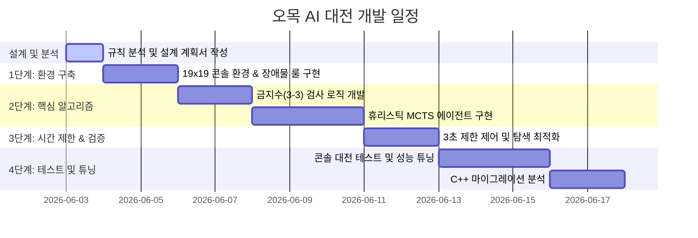

# [개발 계획서] 교내 오목 AI 대전 준비를 위한 개발 계획, 개발 환경 및 일정

본 개발 계획서는 교내 오목 AI 대전 참가를 위해 `alpha_omok` 프로젝트를 확장하고 필수 개발사항 및 추가 고려사항을 만족시키기 위한 전반적인 로드맵과 환경, 일정을 다룹니다. 본 프로젝트는 웹 환경 대신 **텍스트 콘솔(Console) 환경**에서의 대전을 기준으로 개발됩니다.

---

## 1. 개발 목표 및 방향

### 개발 목표
- 19x19 바둑판 크기에서 교내 오목 대회 규정을 완벽하게 만족하는 오목 AI 시스템 구현.
- 흑돌(선수)의 오목판 한가운데(10,10) 자동 착수 및 3개의 빨간색 장애물 돌 임의 지정 기능 개발.
- 3,3(쌍삼) 착수 제한 규칙 준수 및 5목 이상(장목 포함) 승리 판정 구현.
- 상대방 착수 후 최대 3초 이내에 최선의 수를 찾아 착수하는 실시간성 보장.
- **콘솔 입출력 구현**: 유저가 좌표를 `x,y` 형태로 콘솔에 입력하고, AI는 이를 입력받아 계산 후 콘솔에 진행 상황 및 19x19 바둑판을 텍스트로 렌더링.

### 개발 방향 (추가 고려사항 반영)
- **휴리스틱 결합형 MCTS(Heuristic-MCTS) 도입**:
  - 19x19 크기의 큰 바둑판과 무작위 빨간 돌 배치 조건으로 인해, 처음부터 강화학습(AlphaZero)으로 신경망을 훈련하기에는 시간 및 자원이 매우 방대하게 소요됩니다.
  - 따라서, 딥러닝 모델의 학습에 의존하지 않고, 오목의 형태적 가치(5목, 열린 4, 열린 3 등)를 탐색할 수 있는 **휴리스틱 평가 함수(Heuristic Evaluation Function)**를 설계하여 MCTS(Monte Carlo Tree Search)의 가치 평가 및 정책 사전 확률(Prior Probability)로 활용합니다.
  - 이 하이브리드 방식은 별도의 학습 기간이 불필요하며, 대전 환경에서 매우 강력하게 작동합니다.
- **성능 최적화 및 C++ 마이그레이션**:
  - 오목판 크기가 커짐에 따라 파이썬에서의 반복 연산(MCTS 탐색 및 패턴 스캔)이 병목이 될 수 있습니다.
  - 1단계로 파이썬 상에서 NumPy 및 성능 최적화 기법을 사용하여 3초 제한을 충족하는 최적화 에이전트를 먼저 완성합니다.
  - 2단계로 속도 향상이 필수적일 경우 핵심 로직(패턴 스캔 및 MCTS 시뮬레이션 부분)을 C++ 모듈로 포팅하여 Python C Extension 또는 ctypes 형태로 연동하는 Migration 전략을 수립합니다.

---

## 2. 개발 환경 (Development Environment)

| 구분 | 사양 및 도구 | 비고 |
| :--- | :--- | :--- |
| **운영체제(OS)** | Windows 10 / 11 | 사용자 운영체제 호환 |
| **개발 언어** | Python 3.8+ / C++ (필요 시 마이그레이션) | NumPy 연산 최적화 적용 |
| **핵심 라이브러리**| NumPy | 오목 환경 및 알고리즘 구현 |
| **인터페이스** | 텍스트 콘솔 (Console) | 사용자 입출력 (`x,y` 형식 좌표 입력) |
| **버전 관리** | Git | `alpha_omok` 로컬 저장소 기반 |

---

## 3. 개발 일정 및 마일스톤 (Schedule)

개발 일정은 단기간에 효율적인 작동 모델을 완성하고 테스트 및 최적화를 수행할 수 있도록 총 5단계로 설계되었습니다.

### 상세 일정 내용

1. **Phase 1: 콘솔 환경 구축 및 규칙 반영 (2일)**
   - 19x19 바둑판 크기를 지원하는 `env_competition.py` 및 콘솔 렌더러 구현.
   - X, Y 좌표 (1~19, 좌하단 원점)와 내부 행렬 인덱스 간의 양방향 변환 모듈 작성.
   - 흑돌 선택 시 첫 수 무조건 (10,10) 착수 및 턴 변경 구현.
   - 게임 시작 전 3개의 빨간색 돌(장애물) 위치 지정 기능 및 착수 불가 상태 적용.

2. **Phase 2: 금지수(3,3) 구현 및 휴리스틱 설계 (2일)**
   - 안막힌 3,3(쌍삼)을 정밀하게 탐지하여 착수 가능 목록(Legal Actions)에서 제외하는 판정 함수 제작.
   - 오목의 돌 배치 패턴(가로, 세로, 대각선)을 신속히 스캔하여 스코어링하는 휴리스틱 평가 함수 설계.

3. **Phase 3: 휴리스틱 MCTS 에이전트 개발 및 시간 제어 (3일)**
   - Heuristic Value 및 Policy를 결합하여 작동하는 `HeuristicMCTS` 에이전트 클래스 구현.
   - 시간 측정 모듈을 연동하여, 연산 시간이 2.8초에 도달하면 MCTS 탐색 루프를 탈출하고 즉시 최선의 수를 반환하도록 제어 장치 마련.

4. **Phase 4: 콘솔 대전 테스트 및 튜닝 (3일)**
   - 개발된 AI 에이전트를 상대로 사람이 콘솔에서 직접 플레이(`x,y` 입력)하며 오버라인 승리, 금지수 우회, 계산 시간 준수 여부를 검증.

5. **Phase 5: 성능 병목 개선 및 C++ Migration 검토 (2일)**
   - 프로파일링 도구(cProfile)를 사용하여 성능 병목(주로 패턴 스캔 루프) 분석.
   - 필요한 경우 해당 함수를 C++ 또는 Cython으로 이식하고 인터페이스 연동 완료.
